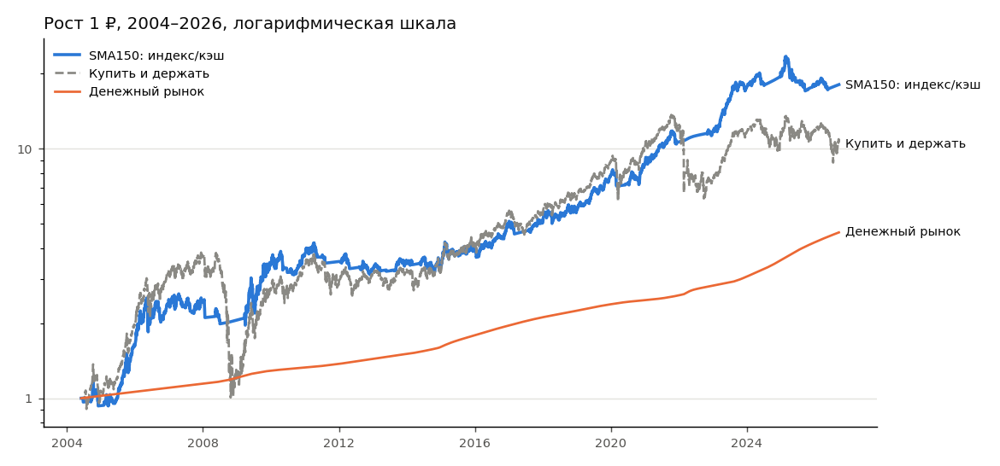
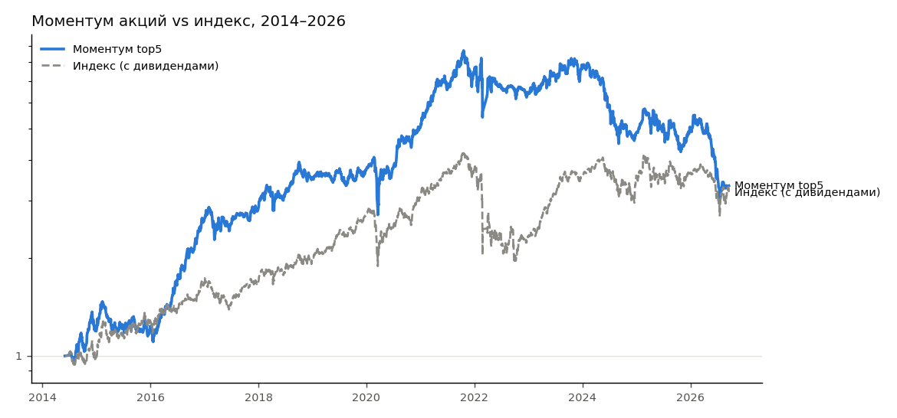

# Таблицы исследования (генерируются автоматически)

## 1. Тайминг индекса: фонд на индекс ↔ денежный рынок (2004–2026)

| Стратегия | Период | CAGR | MaxDD | Sharpe | Calmar | Худший год | Доля в риске |
|---|---|---|---|---|---|---|---|
| Индекс выше SMA50 | 2004–2012 (подбор) | 20.2% | -28.0% | 0.74 | 0.72 | -14.3% | 63.3% |
| Моментум индекса 63д vs кэш | 2004–2012 (подбор) | 19.0% | -30.1% | 0.67 | 0.63 | -19.7% | 59.7% |
| Индекс выше SMA150 | 2004–2012 (подбор) | 14.8% | -27.8% | 0.53 | 0.53 | -15.0% | 66.1% |
| Моментум индекса 126д vs кэш | 2004–2012 (подбор) | 15.1% | -30.5% | 0.54 | 0.50 | -19.9% | 58.5% |
| Индекс выше SMA200 | 2004–2012 (подбор) | 14.9% | -30.5% | 0.53 | 0.49 | -13.8% | 69.5% |
| Индекс выше SMA250 | 2004–2012 (подбор) | 14.3% | -33.6% | 0.51 | 0.43 | -15.2% | 70.8% |
| Моментум индекса 252д vs кэш | 2004–2012 (подбор) | 13.9% | -36.3% | 0.50 | 0.38 | -29.0% | 65.2% |
| Индекс выше SMA100 | 2004–2012 (подбор) | 14.4% | -42.7% | 0.52 | 0.34 | -12.5% | 64.5% |
| Купить и держать индекс | 2004–2012 (подбор) | 14.1% | -73.8% | 0.43 | 0.19 | -66.9% | 99.0% |
| Только денежный рынок | 2004–2012 (подбор) | 4.3% | 0.0% | 0.00 | nan | 2.9% | 0.0% |
| Индекс выше SMA150 | 2013–2021.06 (проверка) | 14.3% | -14.6% | 0.54 | 0.98 | -6.8% | 81.0% |
| Моментум индекса 63д vs кэш | 2013–2021.06 (проверка) | 12.0% | -14.6% | 0.42 | 0.82 | -9.9% | 68.7% |
| Индекс выше SMA100 | 2013–2021.06 (проверка) | 13.2% | -18.6% | 0.48 | 0.71 | -3.5% | 79.4% |
| Купить и держать индекс | 2013–2021.06 (проверка) | 17.0% | -34.4% | 0.59 | 0.49 | -2.6% | 100.0% |
| Индекс выше SMA250 | 2013–2021.06 (проверка) | 10.1% | -25.3% | 0.27 | 0.40 | -13.3% | 85.3% |
| Индекс выше SMA200 | 2013–2021.06 (проверка) | 10.1% | -25.7% | 0.27 | 0.39 | -15.6% | 82.5% |
| Моментум индекса 126д vs кэш | 2013–2021.06 (проверка) | 10.9% | -34.4% | 0.32 | 0.32 | -6.9% | 71.1% |
| Индекс выше SMA50 | 2013–2021.06 (проверка) | 8.0% | -27.4% | 0.15 | 0.29 | -8.0% | 69.4% |
| Моментум индекса 252д vs кэш | 2013–2021.06 (проверка) | 9.5% | -34.4% | 0.24 | 0.28 | -12.9% | 77.1% |
| Только денежный рынок | 2013–2021.06 (проверка) | 6.8% | 0.0% | 0.00 | nan | 1.5% | 0.0% |
| Индекс выше SMA100 | 2021.06–2026 (новые данные) | 15.0% | -18.9% | 0.25 | 0.79 | -1.9% | 54.8% |
| Моментум индекса 126д vs кэш | 2021.06–2026 (новые данные) | 13.1% | -18.8% | 0.12 | 0.70 | 2.6% | 42.7% |
| Индекс выше SMA50 | 2021.06–2026 (новые данные) | 11.4% | -18.7% | 0.00 | 0.61 | -11.5% | 57.9% |
| Моментум индекса 63д vs кэш | 2021.06–2026 (новые данные) | 10.7% | -22.3% | -0.05 | 0.48 | -9.2% | 47.4% |
| Индекс выше SMA150 | 2021.06–2026 (новые данные) | 11.1% | -27.3% | -0.03 | 0.41 | -10.6% | 57.8% |
| Индекс выше SMA200 | 2021.06–2026 (новые данные) | 8.3% | -23.0% | -0.23 | 0.36 | -2.0% | 58.0% |
| Индекс выше SMA250 | 2021.06–2026 (новые данные) | 5.3% | -24.9% | -0.44 | 0.21 | -7.9% | 57.3% |
| Моментум индекса 252д vs кэш | 2021.06–2026 (новые данные) | 2.8% | -51.4% | -0.31 | 0.05 | -29.8% | 39.5% |
| Только денежный рынок | 2021.06–2026 (новые данные) | 12.3% | 0.0% | 0.00 | nan | 8.7% | 0.0% |
| Купить и держать индекс | 2021.06–2026 (новые данные) | -2.8% | -53.9% | -0.34 | -0.05 | -37.8% | 100.0% |

## 2. Стратегии на акциях (2014–2026, без дивидендов)

| Стратегия | Sharpe 2014–17 | Sharpe 2018–21 | Sharpe 2021–26 | CAGR 2014–17 | CAGR 2018–21 | CAGR 2021–26 | MaxDD 2021–26 |
|---|---|---|---|---|---|---|---|
| Купить и держать индекс | 0.41 | 1.03 | -0.34 | 15.6% | 25.0% | -2.8% | -53.9% |
| Моментум акций 126д top5, фильтр SMA200 | 1.01 | 0.70 | -0.46 | 30.5% | 18.6% | 1.0% | -29.4% |
| Моментум акций 126д top3 | 0.48 | 0.81 | -0.56 | 19.5% | 24.9% | -11.4% | -65.3% |
| Равные веса top20 ликвидных | 0.34 | 0.66 | -0.68 | 14.1% | 15.9% | -11.6% | -58.0% |
| Моментум акций 189д top10 | 0.81 | 1.12 | -0.76 | 24.0% | 27.0% | -9.2% | -50.7% |
| Моментум акций 126д top10 | 0.71 | 1.06 | -0.76 | 21.8% | 26.5% | -9.2% | -52.5% |
| Моментум акций 63д top8 | 0.52 | 0.98 | -0.77 | 18.7% | 24.2% | -10.2% | -50.8% |
| Моментум акций 252д top3 | 0.73 | 0.38 | -0.79 | 27.0% | 12.2% | -18.8% | -74.4% |
| Моментум акций 252д top5 | 0.75 | 0.70 | -0.79 | 25.0% | 19.8% | -13.3% | -63.8% |
| Моментум акций 189д top5 | 0.86 | 0.91 | -0.80 | 28.7% | 24.9% | -13.9% | -61.3% |
| Моментум акций 63д top10 | 0.44 | 0.94 | -0.80 | 16.6% | 22.8% | -9.5% | -50.5% |
| Моментум акций 189д top3 | 1.04 | 0.50 | -0.81 | 39.2% | 15.8% | -18.4% | -74.4% |
| Моментум акций 126д top5 | 1.07 | 1.12 | -0.81 | 33.6% | 30.8% | -13.7% | -65.3% |
| Моментум акций 252д top10 | 0.84 | 1.07 | -0.82 | 24.1% | 25.8% | -10.9% | -54.4% |
| Моментум акций 189д top8 | 0.64 | 1.02 | -0.86 | 21.0% | 25.5% | -12.9% | -61.2% |
| Моментум акций 63д top5 | 0.70 | 1.27 | -0.87 | 24.4% | 34.5% | -15.3% | -65.2% |
| Моментум акций 126д top8 | 0.68 | 1.11 | -0.89 | 21.6% | 27.9% | -12.8% | -62.8% |
| Моментум акций 252д top8 | 0.72 | 0.95 | -0.90 | 22.3% | 24.1% | -13.8% | -62.2% |
| Моментум акций 63д top3 | 0.67 | 1.23 | -0.93 | 26.0% | 37.3% | -19.8% | -76.4% |
| Низкая волатильность top10 | -0.34 | 0.68 | -1.07 | 2.0% | 16.8% | -15.5% | -64.2% |
| Разворот 5д top5 | 0.13 | 0.31 | -1.20 | 9.5% | 9.8% | -30.7% | -86.9% |

## 3. Правила вывода прибыли и стоп-кран (старт 100 000 ₽)

| Стратегия | Правила | На счёте, ₽ | Выведено, ₽ | Минимум на счёте, ₽ | Вложения вернулись |
|---|---|---|---|---|---|
| Тайминг SMA150 (2004–2026) | без правил | 1,806,828 | 0 | 93,092 | — |
| Тайминг SMA150 (2004–2026) | только вывод 50% при +15% | 451,833 | 374,865 | 93,092 | 2010-03-31 |
| Тайминг SMA150 (2004–2026) | стоп 20% + вывод | 411,574 | 335,148 | 93,092 | 2016-09-30 |
| Купить и держать индекс (2004–2026) | без правил | 1,039,903 | 0 | 90,531 | — |
| Купить и держать индекс (2004–2026) | только вывод 50% при +15% | 324,981 | 275,051 | 58,224 | 2015-06-30 |
| Купить и держать индекс (2004–2026) | стоп 20% + вывод | 251,484 | 311,067 | 90,531 | 2009-09-30 |
| Моментум top5 (2014–2026) | без правил | 333,757 | 0 | 95,956 | — |
| Моментум top5 (2014–2026) | только вывод 50% при +15% | 125,084 | 198,666 | 95,956 | 2018-09-28 |
| Моментум top5 (2014–2026) | стоп 20% + вывод | 88,547 | 161,693 | 79,934 | 2021-03-31 |
| Тайминг SMA150 (2021.06–2026) | без правил | 174,284 | 0 | 97,435 | — |
| Тайминг SMA150 (2021.06–2026) | только вывод 50% при +15% | 130,808 | 37,476 | 97,435 | — |
| Тайминг SMA150 (2021.06–2026) | стоп 20% + вывод | 130,028 | 37,476 | 97,435 | — |
| Купить и держать (2021.06–2026) | без правил | 86,342 | 0 | 52,438 | — |
| Купить и держать (2021.06–2026) | только вывод 50% при +15% | 86,342 | 0 | 52,438 | — |
| Купить и держать (2021.06–2026) | стоп 20% + вывод | 60,961 | 0 | 44,828 | — |
| Денежный рынок (2021.06–2026) | без правил | 184,122 | 0 | 100,000 | — |
| Денежный рынок (2021.06–2026) | только вывод 50% при +15% | 146,034 | 28,564 | 100,000 | — |
| Денежный рынок (2021.06–2026) | стоп 20% + вывод | 146,034 | 28,564 | 100,000 | — |
